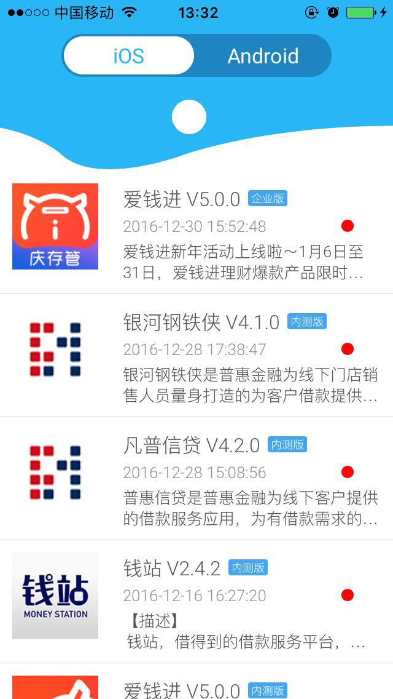

# DistributTools

基于蒲公英的应用分发工具 —— QA宝



### 用法

1、修改 ```PgyerModule``` 中的参数

```
public struct PgyerModule {
    public static let downloadUrl: String = "http://www.pgyer.com/FLhK"
    public static let host: String = "http://www.pgyer.com"
    public static let image_host: String = "http://7kttjt.com1.z0.glb.clouddn.com/image/view/app_icons/"
    
    /// 设置蒲公英参数
    public static let api_key: String = ""
    public static let uKey: String = ""
    public static let aId: String = ""
    public static let aKey: String = ""
}

```
其中

| 参数  | 类型  | 说明 |
|:------------- |:---------------:| :------------- |
| api_key       | String | API Key，用来识别API调用者的身份，如不特别说明，每个接口中都需要含有此参数   |
| uKey          | String | 用户Key，用来标识当前用户的身份 |
| aId           | String | 表示一个App组的唯一ID |
| aKey          | String | 代表一个具体的App的唯一标识 |

2、修改 ```AppIdentifierModule``` 中的参数

```
public struct AppIdentifierModule {
    /// 设置企业版应用的appIdentifier
    public static let enterprise_appIdentifier: String = ""
}

```